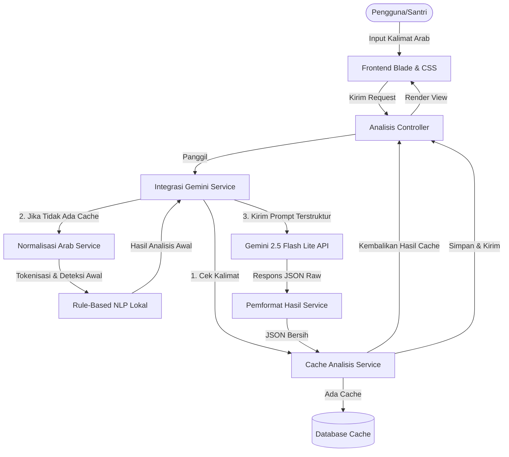

# Smart-Nahwu

[](https://laravel.com)
[](https://www.php.net)
[](https://deepmind.google/technologies/gemini/)

**Smart-Nahwu** adalah sistem analisis tata bahasa Arab hibrida berbasis *Natural Language Processing* (NLP) lokal dan *Large Language Model* (LLM) Gemini. Aplikasi ini dirancang khusus untuk membantu santri dan pembelajar bahasa Arab pemula dalam menganalisis kedudukan sintaksis (*I'rab*) kata per kata berdasarkan standar kaidah kitab klasik **Matan Al-Ajurrumiyyah**.

---

## Fitur Utama

- **Analisis Nahwu & Sharaf (Hibrida NLP - Gemini)**: Menganalisis kalimat Arab secara bertahap melalui alur:
  1. **Preprocessing & NLP Lokal**: Kalimat dinormalisasi, ditokenisasi, serta dianalisis struktur morfologi dasarnya (Sharaf) menggunakan Rule Engine lokal.
  2. **Prompt Engineering & Gemini API**: Hasil analisis awal NLP lokal digabungkan dengan aturan kitab *Al-Ajurrumiyyah* dan dikirim ke Gemini 2.5 Flash Lite API untuk dianalisis kedudukan sintaksis (*I'rab* & Nahwu) secara mendalam.
- **Caching Layer Efisien**: Hasil analisis kalimat disimpan dalam database (`riwayat_analisis`) agar respons berikutnya untuk kalimat yang sama bersifat instan (<10ms) tanpa memakan kuota API.
- **Rujukan Al-Ajurrumiyyah**: Menautkan analisis sintaksis langsung ke bab dan pasal di kitab *Matan Al-Ajurrumiyyah*.
- **Evaluasi & Kuis**: Menyediakan modul kuis interaktif per bab nahwu untuk melatih pemahaman tata bahasa santri.
- **Panel Dashboard Multi-Role**: Fitur dashboard terpisah untuk **Admin** (mengelola modul kuis, bab, dan pengguna) dan **Santri** (melihat pencapaian, statistik kuis, dan riwayat analisis).
- **Keandalan Tinggi**: Diuji dengan *automated tests* (PHPUnit) untuk menjamin kualitas kode.

---

## Arsitektur Sistem

Aplikasi ini menggunakan pola arsitektur **Model-View-Controller (MVC)** dengan alur pemrosesan **NLP - Gemini** sebagai berikut:



---

## Tech Stack & Prasyarat

- **PHP**: `^8.2`
- **Framework**: Laravel `^12.0`
- **Database**: MySQL / MariaDB
- **Node.js & NPM**: Untuk build asset frontend (Vite & CSS/JS)
- **Gemini API Key**: Diperlukan untuk mode analisis online

---

## Panduan Instalasi & Penggunaan

Ikuti langkah-langkah di bawah ini untuk menjalankan Smart-Nahwu di lokal Anda:

### 1. Klon Repositori
```bash
git clone https://github.com/achmdhisyam/smart-nahwu.git
cd smart-nahwu
```

### 2. Setup Otomatis (Direkomendasikan)
Aplikasi ini sudah dilengkapi dengan script setup komposer pintar. Cukup jalankan perintah berikut untuk menginstal dependensi PHP, membuat file `.env`, men-generate aplikasi key, menginstal package NPM, dan melakukan build asset:
```bash
composer run setup
```

### 3. Konfigurasi Environment (`.env`)
Buka file `.env` yang baru dibuat di root project Anda, lalu konfigurasikan hal-hal berikut:

- **Database**: Sesuaikan koneksi DB sesuai server lokal Anda (misalnya Laragon/XAMPP).
  ```env
  DB_CONNECTION=mysql
  DB_HOST=127.0.0.1
  DB_PORT=3306
  DB_DATABASE=smart_nahwu
  DB_USERNAME=root
  DB_PASSWORD=
  ```
- **Gemini API Key**: Masukkan API key dari Google AI Studio untuk mengaktifkan analisis bertenaga AI.
  ```env
  GEMINI_API_KEY=your_gemini_api_key_here
  ```

### 4. Seed Database
Masukkan data awal (bab nahwu, kuis, dan pencapaian) ke database:
```bash
php artisan db:seed
```

### 5. Jalankan Server Pengembangan
Gunakan perintah pintas composer berikut untuk menjalankan server Laravel, Vite, dan queue secara bersamaan:
```bash
composer run dev
```
Buka [http://127.0.0.1:8000](http://127.0.0.1:8000) pada browser Anda.
